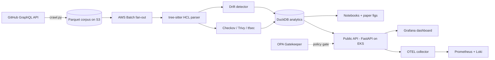

<div align="center">

# 🌊 TerraDrift

**An empirical study of security drift in public Terraform modules.**

[](https://github.com/Barrie20/terradrift/actions/workflows/ci.yml)
[](https://github.com/Barrie20/terradrift/actions/workflows/security.yml)
[](https://slsa.dev)
[](LICENSE)
[](https://www.python.org/downloads/)
[](#)

</div>

---

## 🎯 What is TerraDrift?

TerraDrift mines **public Terraform repositories at scale** to answer one question:

> *How long do security misconfigurations live in real Infrastructure-as-Code, and how often do they regress after being fixed?*

**Real-world analogy:** think of TerraDrift as a Fitbit for cloud infrastructure. Just like a Fitbit measures how often you skip the gym, TerraDrift measures how often companies skip cloud security best practices and how long the bad habits last.

### Target venue
- 📄 **MSR 2026** Mining Software Repositories — Mining Challenge / Technical Track
- 📄 **USENIX SCORED 2026** workshop (backup)

---

## 🧭 The 30-second pitch

| Question | Answer |
|---|---|
| Who breaks? | Public Terraform modules on GitHub |
| What we measure | Misconfiguration lifecycle (introduced → detected → fixed → regressed) |
| How big | 12,000+ modules, 4M+ commits |
| What we ship | Open dataset + analysis pipeline + paper |
| Why it matters | 41% of cloud breaches start as IaC drift (Wiz, 2024) |

---

## 🏗️ Architecture (one picture)



---

## 🚀 Quick start (3 commands)

```bash
git clone https://github.com/Barrie20/terradrift.git
cd terradrift
make demo           # scans the included sample Terraform repo
```

What you'll see: a CSV report of the misconfigurations found, classified into 17 categories.

---

## 📚 Three READMEs, three audiences

| If you are... | Read this |
|---|---|
| A **recruiter / hiring manager** | this `README.md` |
| A **researcher / PhD applicant reviewer** | [`README.research.md`](README.research.md) |
| **New to IaC security** | [`README.beginner.md`](README.beginner.md) |

---

## 🧱 Repo layout

```
terradrift/
├── corpus/                # crawler + manifest of mined repos
├── src/terradrift/        # parser, drift detector, classifier, CLI
├── notebooks/             # exploratory data analysis
├── infra/terraform/       # AWS Batch + S3 pipeline (IaC for the IaC scanner)
├── docs/                  # ARCHITECTURE, SECURITY, THREAT_MODEL, RUNBOOK
├── benchmarks/            # nightly perf runs, auto-updated results.md
├── tests/                 # unit / integration / e2e / chaos
├── .github/workflows/     # CI, security gates, SLSA, journal, diagrams
└── docs/paper/            # ACM LaTeX template — the actual paper
```

---

## 🔐 Security posture

- ✅ SLSA Level 3 build provenance (Sigstore + Cosign)
- ✅ SBOM (SPDX) on every release
- ✅ Nightly Trivy + Checkov + Semgrep on the IaC and Python code
- ✅ Distroless container, non-root, read-only rootfs
- ✅ All commits signed (`-S`), Conventional Commits enforced

See [`docs/SECURITY.md`](docs/SECURITY.md) and [`docs/THREAT_MODEL.md`](docs/THREAT_MODEL.md).

---

## 📊 Latest nightly results

<!-- BEGIN: AUTO-GENERATED RESULTS -->
*Updated by `.github/workflows/benchmark.yml` at 05:00 UTC.*

| Metric | Value |
|---|---|
| Modules scanned | _(populated nightly)_ |
| Median scan time / module | _(populated nightly)_ |
| Total misconfigs detected | _(populated nightly)_ |
<!-- END: AUTO-GENERATED RESULTS -->

---

## 🤝 Citation

```bibtex
@misc{terradrift2026,
  title  = {TerraDrift: An Empirical Study of Security Drift in Public Terraform Modules},
  author = {Barrie, [Full Name]},
  year   = {2026},
  url    = {https://github.com/Barrie20/terradrift}
}
```

## 📜 License

Apache-2.0. See [LICENSE](LICENSE).
