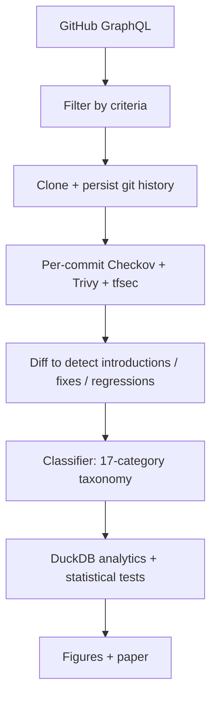

# TerraDrift — Research README

> Companion artifact to the manuscript:
> **"An Empirical Study of Security Drift in Public Terraform Modules"** (under preparation, MSR 2026).

## 1. Research questions

- **RQ1.** What is the distribution and lifecycle of security misconfigurations across public Terraform modules?
- **RQ2.** How long does a CRITICAL/HIGH Checkov violation live in `main` before being fixed?
- **RQ3.** How often do previously-fixed misconfigurations *regress*?
- **RQ4.** Are there community signals (stars, contributors, CI presence) that predict lower drift?

## 2. Dataset

| Attribute | Value |
|---|---|
| Source | GitHub public repos with `*.tf` files |
| Selection criteria | ≥10 commits, ≥1 star, last commit within 24 months |
| Crawl date | TBD (snapshot SHA in `corpus/manifest.parquet`) |
| Target size | 12,000–15,000 modules, ~4M commits |
| Storage format | Parquet on S3 (versioned, object-locked) |
| Hash manifest | SHA-256 per module, signed with Cosign |

## 3. Methodology



## 4. Reproducibility

```bash
make reproduce               # full pipeline (~6h on c6i.8xlarge)
make reproduce-mini          # 200-module subset (~15 min on a laptop)
```

The `make reproduce-mini` flow is the one reviewers can run on a laptop.

## 5. Threats to validity

- **External validity:** public Terraform ≠ enterprise Terraform.
- **Construct validity:** Checkov rules evolve; we pin Checkov 3.x and report results per version.
- **Internal validity:** classifier categories are derived from Checkov + manual coding (Cohen's κ reported in §6).

## 6. Artifact availability

- Code: this repository (Apache-2.0)
- Dataset: Zenodo DOI on first paper submission
- Container: `ghcr.io/barrie20/terradrift:vX.Y.Z` (signed, SLSA L3)

## 7. Novelty vs. prior work

| Prior | Gap we address |
|---|---|
| Rahman et al. (ICSE'19) — IaC smells in Puppet | Terraform-specific, security-focused, lifecycle |
| Begoug et al. (MSR'23) — Terraform smells | Static, no temporal/regression analysis |
| Bhuiyan et al. (EMSE'24) — IaC defects | Defects ≠ security misconfigs; we focus on Checkov-classified CWEs |

## 8. Roadmap

- [x] Crawler skeleton
- [ ] 1k-module pilot snapshot
- [ ] Manual coding for taxonomy validation
- [ ] Full corpus crawl
- [ ] Statistical analysis
- [ ] Paper draft v1
- [ ] Internal review
- [ ] Submission

## 9. License

Code: Apache-2.0. Paper text and figures: CC-BY-4.0.
