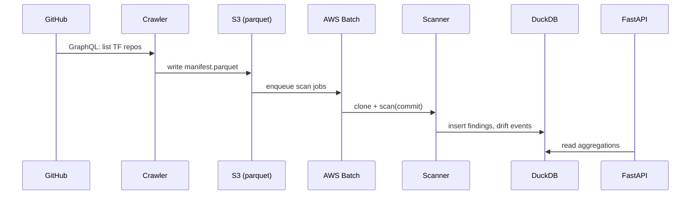

# Architecture

> Plain-English version: imagine a giant assembly line that picks up Terraform
> files from GitHub, sends them through three different inspectors, then
> writes everything into one big spreadsheet we can ask questions of.

## Components

| # | Component | Purpose | Real-world analogy |
|---|---|---|---|
| 1 | `corpus/crawl.py` | Fetches public Terraform repos via GitHub GraphQL | The forklift driver |
| 2 | `parser/` (tree-sitter HCL) | Turns `.tf` files into a syntax tree | The X-ray machine |
| 3 | `analyzer/` (Checkov / Trivy / tfsec) | Detects misconfigurations | The three inspectors |
| 4 | `drift/` | Compares findings between commits | The "spot the difference" judge |
| 5 | `classifier/` | Maps Checkov rules to 17 categories | The triage nurse |
| 6 | DuckDB warehouse | Stores findings + drift events | The filing cabinet |
| 7 | FastAPI service | Public read API + dashboard | The reception desk |
| 8 | OPA Gatekeeper | Policy gate on the API | The security guard |

## Data flow

## Why DuckDB

- Ships as a single binary — reviewer-friendly
- Reads parquet directly — no ETL
- 5–50× faster than SQLite for OLAP

## Why distroless

- Smaller attack surface
- Required for SLSA L3 + reproducible builds
